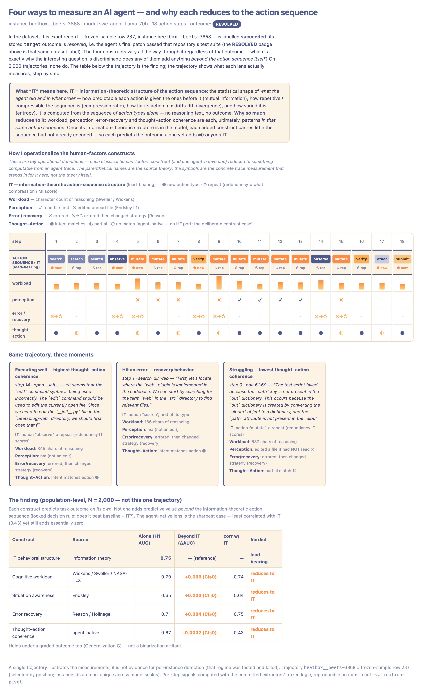

# Measuring AI Coding Agents: a construct-validation study

**One-sentence finding:** for predicting whether an AI coding agent
resolves its task, the *information-theoretic structure of its action
sequence* is the load-bearing measurement — four further constructs
(three human-factors ports and one agent-native) each predict the
outcome on their own, yet **none add predictive value beyond it**, and
this holds under a graded outcome.



*(Interactive/static figure: [`demo/index.html`](demo/index.html);
the image above is a snapshot of it. Full narrative and evidence
ledger: [`docs/PROJECT_SNAPSHOT.html`](docs/PROJECT_SNAPSHOT.html).)*

---

## What this project is

It began as **CAFT** — a real-time, per-session anomaly detector for
coding agents (information-theoretic metrics over a sliding window,
mapped onto Wickens' information-processing stages). Disciplined
validation **killed the per-session detector** and, in doing so,
produced a sharper and more defensible result. This repository is the
honest arc, not a product pitch.

### The arc

1. **The autopsy (negative result).** Validated against a domain
   expert, the original detector agreed *worse than chance*
   (κ = −0.04). Three independent baseline designs all failed the same
   way — they fired on a calibration/window-fill transient, not on
   session content. Per-step single-session pathology detection
   **does not work**; it was documented, not buried, and retired
   (`docs/CONSTRUCT_REVISION.md`).
2. **The reframe.** What survived was the *measurement*, not the
   construct on top of it: the information-theoretic (IT) metrics
   (mutual information, compression, KL, entropy of the action
   sequence) are real, deterministic descriptions of behavioral
   structure. The project pivoted to **population-level construct
   validation** against an external, outcome-labelled corpus
   (SWE-agent trajectories; test-based pass/fail — non-circular).
3. **IT validated (positive result).** Pre-registered pilot, frozen
   N = 2,000. IT predicts task outcome (H1 AUC **0.75** vs
   permutation-null p95 0.53) and adds over a trivial baseline
   (ΔAUC **+0.044**, 95% CI [+0.026, +0.062]). Modest, robust,
   non-artifactual.
4. **Everything else collapses into it (the finding).** Four further
   constructs — cognitive workload (Wickens/Sweller/NASA-TLX),
   situation awareness (Endsley), error recovery (Reason/Hollnagel),
   and an agent-native thought–action coherence — were each
   pre-registered, gated, and tested with a locked decision rule. Each
   predicts the outcome alone (AUC 0.65–0.71); **not one adds
   predictive value beyond IT** (all leg-defining ΔAUC ≤ 0.006, 95% CI
   spanning 0). The agent-native lens is the sharpest case: least
   correlated with IT (0.43) yet still ≈0 incremental.
5. **Not a binarization artifact (generalization).** Re-run against a
   *graded* outcome (fraction of tests passing): IT still predicts
   (Spearman 0.277 vs null 0.046; ΔSpearman +0.101, CI excludes 0) and
   no construct re-separates. The rival explanation is rejected on
   this axis.

### Why this is credible — the discipline

Pre-registration committed *before* any data-touching code; a
symbolization-audit gate + mandatory human checkpoint per leg;
label-shuffle null models for every comparison; convergent **and**
discriminant validity; locked decision rules executed from the data
with no threshold re-weighed post-hoc; honest scoping (constructs the
corpus could not support were excluded with documented reasons, never
faked); dated amendments for every mid-stream under-specification;
test-first throughout (~1,000 tests; several caught real bugs before
they could corrupt a result). Negatives reported with no spin.
**The methodology is the reusable asset.**

### Scope of the claim (the boundary, stated plainly)

One corpus (nebius SWE-agent trajectories), one agent family (Llama,
reactive ReAct), one outcome family (SWE-bench resolution).
Generalization G is conditional on a selection bias (its parseable
subset over-represents successes). Cross-architecture generalization
(a planning agent vs the reactive one) is the single open axis and is
deliberately deferred. **"Agents are universally flat" is not
claimed.**

---

## Repository layout

| Path | What it is |
|------|------------|
| `demo/` | The figure: `index.html` (self-contained, no deps) + `preview.png` + how it is built (`build_trajectory_demo.py`) |
| `docs/PROJECT_SNAPSHOT.html` | The full arc as a one-page visual |
| `docs/PROGRAM.md` | Governing document + standing discipline every leg inherited |
| `docs/PREREG_*.md`, `docs/PILOT_PREREGISTRATION.md` | Per-leg pre-registrations (committed before data) |
| `docs/CONSTRUCT_REVISION.md` | The CAFT autopsy (the documented negative) |
| `docs/VALIDATION_METHODOLOGY.md`, `docs/CORPUS_SCOPING.md` | Method + honest-scoping decisions |
| `docs/pilot/` | Result artifacts (AUCs, ΔAUCs, p-values) |
| `agentdiag/validation/` | The validation pipeline (sampling, features, audit, hypotheses, per-leg modules) |
| `agentdiag/adapters/` | `ObservableEvent` contract + agent adapters (SWE-agent, Claude Code) |
| `agentdiag/caft/`, `agentdiag/eval/` | The earlier CAFT detector + its eval harness (retired; kept as part of the honest arc) |
| `tests/` | ~1,000 tests covering the pure machinery |

## Reproduce

```bash
pip install -e .
python -m pytest tests/ -q                 # the test suite
python demo/build_trajectory_demo.py        # regenerate demo/index.html
```

Every number in the snapshot is reproducible from the frozen,
seed-locked pipeline on branch `construct-validation-pivot`. Empirical
phase complete — project at rest by author direction; the methodology
paper is deferred.
